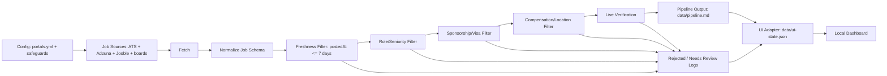

# Career Ops: Personalized Job Scanner

This repository is my customized Career Ops system for managing a technical GTM and AI/SaaS job search. It started as a fork of `santifer/career-ops`, and I adapted the scanner, filters, provider integrations, and documentation around my own job-search workflow.

The system helps me scan job sources, normalize postings, reject bad-fit roles, live-verify job links, and maintain a focused pipeline of roles worth reviewing or applying to.

## Why I Customized This

Generic job boards produce a lot of noise: stale listings, senior roles disguised by broad titles, jobs with unclear sponsorship language, commission-heavy roles, and postings that look relevant only because they match one keyword.

I customized this project to make the scanner behave more like a career-operations assistant for my search. The goal is not to save every possible match. The goal is to find fresh, entry-level-friendly, technically aligned roles and keep bad-fit postings out of my pipeline.

My target search area is technical GTM and customer-facing technology work, including:

- Solutions Engineering and Sales Engineering
- Solutions Consulting and Technical Consulting
- Implementation and Professional Services
- Technical Customer Success and Customer Engineering
- AI, data, automation, cloud, and SaaS solution roles
- Select technical GTM operations roles when they match my profile

## What This System Does

- Reads job-source configuration from `portals.yml`.
- Fetches jobs from direct providers and U.S. aggregator APIs.
- Normalizes raw provider data into a common internal job shape.
- Applies freshness, role-fit, seniority, sponsorship, compensation, and location filters.
- Deduplicates jobs before they reach the pipeline.
- Live-verifies job URLs before saving them.
- Writes verified matches to `data/pipeline.md`.
- Writes rejected or questionable jobs to audit/review outputs instead of mixing them with verified matches.

This is a human-in-the-loop workflow. The scanner helps prioritize and audit opportunities, but it does not submit applications for me.

## My Customizations

The main customizations in this fork are:

- Technical GTM role targeting using the existing role-tier architecture.
- Expanded role coverage for associate, junior, entry-level, early-career, implementation, customer-facing, AI/SaaS, and GTM-adjacent roles.
- Strict 7-day posting freshness filtering through `max_post_age_days: 7`.
- Entry-level and associate safeguards that reject obvious senior, staff, principal, lead, manager, director, architect, or high-years-experience roles.
- Sponsorship safeguards that reject explicit no-sponsorship, U.S. citizen-only, green-card-only, and authorized-without-sponsorship language.
- Compensation and location filters tailored to my search preferences.
- Live job verification before writing jobs into the pipeline.
- Rejected-job logging so I can audit why postings were filtered out.
- U.S. aggregator provider support, including Adzuna and Jooble.
- Direct ATS board support for Ashby, Greenhouse, and Lever company boards.
- Portal validation that reports which tracked companies resolve to supported ATS providers.
- Provider-aware verification behavior for redirect-heavy aggregator links.

## Job Matching And Filtering Logic

The scanner is designed around quality over quantity. A job must survive multiple gates before it can enter `data/pipeline.md`.

The intended flow is:

```text
source fetch
  -> normalize job
  -> extract posting date
  -> freshness gate
  -> role and seniority gate
  -> sponsorship gate
  -> compensation and location gate
  -> dedupe
  -> live verification
  -> pipeline output or rejection log
```

Key rules:

- Jobs must have a reliable posting date within the configured freshness window.
- Jobs older than 7 days are rejected.
- Jobs with missing or unreliable posting dates do not automatically pass.
- Strong keyword matches do not override seniority, sponsorship, location, or compensation safeguards.
- Roles with explicit no-sponsorship language are rejected even if the title is a strong match.
- Jobs must be live-verified before being written to the verified pipeline.

## Architecture Overview



Important scanner files:

- `scan.mjs`: main scan pipeline, filtering, freshness checks, verification, dedupe, and output routing.
- `providers/ashby.mjs`: Ashby direct company-board provider.
- `providers/greenhouse.mjs`: Greenhouse direct company-board provider, including current and older board URL formats.
- `providers/lever.mjs`: Lever direct company-board provider.
- `providers/adzuna.mjs`: Adzuna API provider.
- `providers/jooble.mjs`: Jooble API provider.
- `validate-portals.mjs`: validates portal configuration and reports provider detection for tracked company boards.
- `docs/materials-generation.md`: default rules for generating tailored resumes and cover letters from private source files.
- `portals.yml`: local job-source, role-tier, location, freshness, and provider configuration.
- `config/job_safeguards.yml`: strict seniority, years-of-experience, sponsorship, and role-fit safeguards.
- `data/pipeline.md`: verified job pipeline output.
- `data/rejected-jobs.tsv`: rejected-job audit output.
- `data/needs-review.md`: optional manual-review output when enabled.
- `scripts/build-ui-state.mjs`: converts scanner outputs into a single local JSON contract for UI work.
- `scripts/serve-ui.mjs`: serves the local desktop dashboard and token-free API actions.
- `scripts/match-career-context.mjs`: ranks private career-context sections against a cached job description without using an LLM.
- `ui/`: dependency-free desktop dashboard for reviewing pipeline, needs-review, rejected jobs, scan summaries, and company coverage.

### Local UI Data Contract

The UI should read `data/ui-state.json` instead of parsing Markdown and TSV files directly. The adapter keeps the dashboard independent from scanner output formatting and makes room for review actions, company coverage analysis, scan summaries, and career-context matching.

The generated JSON includes:

- `pipeline`: jobs already in the apply pipeline.
- `needs_review`: jobs requiring manual review before application.
- `rejected`: jobs rejected by freshness, seniority, sponsorship, verification, or other safeguards.
- `queues`: action-aware working queues for active review, handled review, active pipeline, applied jobs, and apply-today jobs.
- `scan_history`: provider scan history for auditability.
- `latest_scan_summary`: current scan totals and provider/filter breakdowns.
- `company_coverage`: tracked-company coverage by provider and recent scan activity.
- `career_context`: private career-source sections prepared for future matching workflows.
- `job_actions`: local UI decisions such as moving a reviewed job into the pipeline.
- `generation_requests`: token-gated document requests waiting for an explicit generation command.
- `stats`: summary counts for dashboard views.

The dashboard itself is token-free. Resume generation, cover letter generation, application answers, and AI job evaluation should remain explicit token-cost actions triggered by user intent.

The dashboard is desktop-first. Its main workflow is a sidebar-driven review cockpit with compact job rows, a detail panel, action logging, scan summaries, and company coverage views.

Clicking `Run Scan` in the dashboard runs the existing scanner command, rebuilds the local UI state, and refreshes the dashboard results. This uses the same local environment and private ignored files that `npm run scan` uses.

The action log is append-only. `scripts/build-ui-state.mjs` reads `data/job-actions.tsv` and derives:

- active review jobs that still need a human decision,
- handled review jobs that were moved or rejected,
- active pipeline jobs that are not yet marked applied,
- applied jobs,
- apply-today jobs moved into the pipeline during the current day.

Generation requests are also append-only. Clicking `Queue Resume` or `Queue Letter` writes a local queue item to `data/generation-requests.tsv`; it does not call an LLM.

Job descriptions can be cached locally before generation:

```bash
npm run cache:jd -- --url "https://example.com/job" --company "Example" --title "Example Role"
```

The dashboard exposes the same token-free cache action through `Cache JD`. Cached descriptions are stored in ignored Markdown files under `data/job-descriptions/`.

After caching a JD, career evidence can be matched locally:

```bash
npm run match:career-context -- --job-id "job-id-from-ui-state"
```

The dashboard exposes the same token-free action through `Match Context`. Matching output is stored in ignored JSON files under `data/context-matches/` and ranks relevant private career sections/bullets for later generation.

The explicit command boundary for later token-cost generation is:

```bash
npm run generate:queued-materials
```

The dashboard exposes the same deterministic path through `Run Local Generator` in the Generation Queue view. That action checks whether private career sources, resume rules, cached job descriptions, and career-context matches are present. Ready requests are converted into local Markdown, HTML, and PDF drafts under ignored `output/generated-materials/`; blocked requests are marked in `data/generation-requests.tsv`.

Each generated PDF receives a `.validation.json` sidecar. Resume requests are expected to render as one page; if validation detects a layout issue, the request status becomes `generated_needs_layout_review` instead of plain generated. If content is too sparse or placeholder-heavy, the request status becomes `generated_needs_content_review`. This local generator is deterministic and token-free. It is a staging layer for review and future LLM generation, not a substitute for final human review. Job descriptions, context matches, and generated materials should stay in ignored local paths such as `data/job-descriptions/`, `data/context-matches/`, and `output/`.

The Generation Queue view acts as the local materials browser. For generated requests, it shows PDF, HTML, Markdown, and validation links when those files exist, plus page/word badges and validation issues. The local file endpoint is constrained to ignored generated/context paths so private outputs can be reviewed in the browser without making them public.

The supporting local adapter files are generated and ignored by git:

- `data/latest-scan-summary.json`
- `data/company-coverage.json`
- `data/career-context.json`
- `data/job-actions.tsv`
- `data/generation-requests.tsv`
- `data/context-matches/`
- `data/ui-state.json`

Build the full local app state with:

```bash
npm run build:app-state
```

Or build each adapter separately:

```bash
npm run build:scan-summary
npm run build:company-coverage
npm run build:career-context
npm run build:ui-state
```

The career-context adapter reads private files by default, so its generated output should stay local:

```text
private/cv.md
private/config/profile.yml
```

The repository also includes public-safe document structure templates in `templates/material-kit/`. They are placeholders only; private facts are loaded from ignored local sources at generation time.

### Direct ATS Company Boards

The scanner can read direct company boards from supported ATS providers. This lets a private `tracked_companies` list point to first-party company hiring pages instead of relying only on broad job-board aggregators.

Supported direct ATS URL formats include:

- Ashby: `https://jobs.ashbyhq.com/{companySlug}`
- Lever: `https://jobs.lever.co/{companySlug}`
- Greenhouse: `https://job-boards.greenhouse.io/{companySlug}`
- Greenhouse EU: `https://job-boards.eu.greenhouse.io/{companySlug}`
- Greenhouse legacy: `https://boards.greenhouse.io/{companySlug}`
- Greenhouse API: `https://boards-api.greenhouse.io/v1/boards/{companySlug}/jobs`

`npm run validate:portals` reports how many tracked companies resolve to Ashby, Greenhouse, Lever, or unsupported/custom sources. Unsupported company career pages are warnings rather than hard failures, because some target companies intentionally require web search or custom handling.

## Important Safeguards

### Freshness

This fork uses a strict freshness window:

```yaml
max_post_age_days: 7
max_job_age_days: 7
```

`max_job_age_days` is retained for compatibility, but the active intent is a 7-day posting-date gate. A discovered date, scraped date, or scan date should not be treated as a real posting date unless the source has no better date and the job is routed for review instead of automatic save.

### Seniority

The scanner prioritizes roles that are entry-level, junior, associate, new-grad, early-career, or approximately 0-3 years of experience.

It rejects obvious senior roles, including titles or descriptions with senior, staff, principal, lead, manager, director, VP, head of, architect, or high required years of experience unless the posting clearly belongs to an associate support lane and is handled conservatively.

### Sponsorship

Explicit sponsorship blockers are treated as hard rejections. The scanner rejects jobs that say no sponsorship, no visa sponsorship, must be a U.S. citizen, green-card-only, permanent authorization required, or authorized without sponsorship.

Unknown sponsorship is not treated as a guarantee. It remains an evaluation signal.

### Compensation And Location

Compensation and location filters remain part of the scan pipeline. The technical GTM expansion does not weaken those filters.

The scanner is configured around U.S.-based and relocation-friendly roles, with remote U.S. and major U.S. tech hubs prioritized.

### Live Verification

Jobs must pass live verification before being saved to `data/pipeline.md`. The verifier checks final URLs, HTTP status, expired/closed text, unavailable pages, and provider redirect behavior.

Jobs that are dead, expired, blocked, duplicate, missing reliable dates, or otherwise unverified are routed away from the verified pipeline.

## Challenges And Fixes

### Stale Aggregator Listings

Some third-party API listings can remain available through an API even after the actual job page is gone. The scanner now verifies job links before writing them to the pipeline and records stale or rejected jobs in an audit log.

### Aggregator Redirects And Bot Blocking

Jooble links can use redirect-style URLs that return HTTP 403 or trigger browser-like access requirements during verification. I added provider-aware verification behavior and classification so these jobs are not blindly saved, but can still be audited or routed for manual review when appropriate.

### Overly Broad Freshness

The scanner previously supported a broader age window. I tightened the configured freshness gate to 7 days so the pipeline focuses on current postings instead of older jobs that may already be stale or heavily saturated.

### Keyword Matches Were Not Enough

Some roles can look relevant by title while still requiring senior-level experience or containing explicit sponsorship blockers. I added a requirements safeguard layer so freshness and keyword matches cannot override seniority or sponsorship fit.

## Project Status

Current state:

- The scanner is customized for my technical GTM and AI/SaaS job search.
- Adzuna and Jooble provider modules exist as separate aggregator providers.
- Live verification is part of the save path before jobs enter the pipeline.
- Strict 7-day freshness, seniority, sponsorship, compensation, and location safeguards are represented in the scanner/configuration.
- Rejected-job and manual-review routing exists for auditability.

This repo is still a personalized working system, not a general-purpose product release. Some local files contain private job-search data and should not be committed publicly.

## How To Run Locally

Install dependencies:

```bash
npm install
```

Install Chromium for Playwright-backed verification and document generation:

```bash
npx playwright install chromium
```

Create a local environment file:

```bash
cp .env.example .env
```

Create a local scanner configuration from the public template:

```bash
cp templates/portals.example.yml portals.yml
```

Add provider credentials as needed:

```bash
ADZUNA_APP_ID=your_adzuna_app_id_here
ADZUNA_APP_KEY=your_adzuna_app_key_here
JOOBLE_API_KEY=your_jooble_api_key_here
```

Validate configuration:

```bash
npm run validate:portals
```

Run a safe dry run:

```bash
npm run scan -- --dry-run
```

Run a real scan:

```bash
npm run scan
```

Build the local UI state file:

```bash
npm run build:app-state
```

Start the local desktop dashboard:

```bash
npm run ui
```

Then open:

```text
http://127.0.0.1:4173
```

Optional same-network access is available for testing from another device:

```bash
npm run ui:lan
```

The primary supported workflow is local desktop use through `npm run ui`.

## Privacy And Commit Hygiene

This project uses local files that may contain personal data, application history, job-search strategy, or API credentials. Before pushing publicly, review the working tree carefully.

Files that should generally stay private include:

- `.env`
- `cv.md`
- `config/profile.yml`
- `portals.yml`
- `data/pipeline.md`
- `data/scan-history.tsv`
- `data/rejected-jobs.tsv`
- `data/scan-results-*.md`
- `data/needs-review.md`
- `output/`
- personal writing samples, story banks, and application materials

The `.gitignore` protects many personal files, but untracked generated files should still be checked before committing.

## Repository Origin And Attribution

This project was originally forked from [santifer/career-ops](https://github.com/santifer/career-ops). I customized it into a personalized Career Ops system for my own technical GTM and AI/SaaS job search workflow. Original project structure and license are preserved where applicable.

The original project provided the open-source foundation for the broader Career Ops workflow. This fork focuses on my own scanner configuration, role targeting, provider integrations, filtering safeguards, and pipeline process.

## License

This repository preserves the original license where applicable. See [LICENSE](LICENSE) for details.
